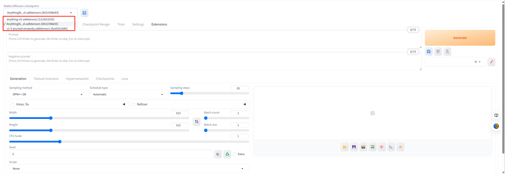
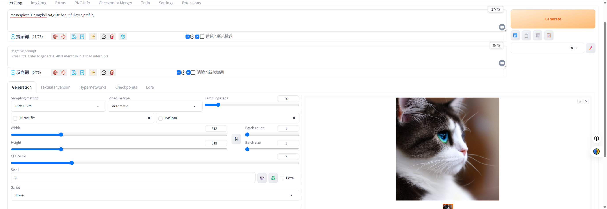

  <a href="http://10.102.104.22:7860" target="_blank">
    <button style="padding: 10px 20px; font-size: 16px;">开始创作！</button>
  </a>

---
搭建这个服务的本意是给没有合适的照片，或者注重隐私保护（不是）的同学提供额外的选择来充当本网站的个人头像。
__敬告，请文明使用AI服务！！！__
言归正传，以下是对webui的一个快速上手教程，由于本人在这方面也是纯小白，因此如有错误请见谅，更详细的教程请参考[手册](https://docs.stablediffusion.cn/article/1.html)。

## 模型选择

SD以存盘点（checkpoint）来区别生图模型，在ui的左上角可以切换不同模型。

目前提供的模型如下：
### v1-5-pruned-emaonly
[SD-1.5](https://huggingface.co/stable-diffusion-v1-5/stable-diffusion-v1-5)，原生diffusers，生图偏向于现实。
### AnythingXL_xl & anything-v5
[万象熔炉](https://civitai.com/models/9409/or-anything-xl)，前者是一个完全的二次元风格模型，后者产出的效果更写实。
### flux1-dev-fp8
[Black Forest FLUX](https://huggingface.co/black-forest-labs/FLUX.1-dev)，Hugging Face上收藏量第一，下载量仅次于SD-1.5的T2I模型，擅长处理人手、文字。WEBUI似乎不太支持直接使用FLUX，我尝试的时候经常失败，但出图质量确实高。

## Text2Image

### Prompt
将你期望生成的样子尽可能详细的描述给模型，我已经内置相关扩展，可以接收中文，还可以为你自动关联一些prompt。prompt可以是提示词也可以是自然语言，请尽可能多的提供prompt，这对于出图质量非常重要。

### Negative Prompt
将你不希望出现的情况提前告诉模型，比如多余的手指、非人类的表情或体型等等。

### Generation
## 请及时保存自己满意的图片到本地，服务器上的数据会不定时清空 ##
#### Batch count
一次推理的出图数量，我建议可以调到2~4张，因为一次指出一张图的效果往往不佳。
#### Seed
随机种子，记录每次出图的风格，在SD中每次推理都是无记忆的，如果你想保留上次图片的风格，必须记录UI界面右下角显示的图片种子，并填写到Seed栏中。

### Lora
Lora是一种在大模型基础上进行微调的小模型，对于有特定风格的图片，Lora的优势很大，不过目前我只内置了一个对猫特调的lora模型。若想使用lora，请点击UI界面显示的lora模型，会自动填入prompt。

