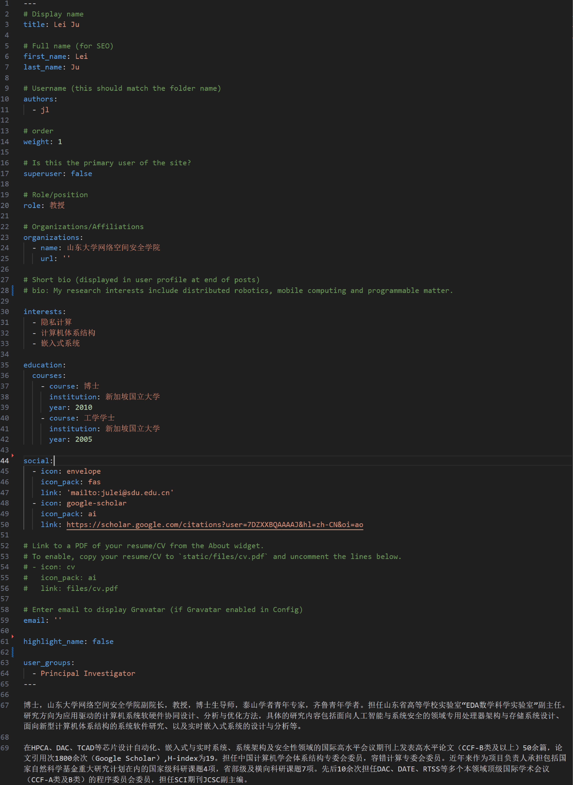

## 编辑个人页面

在`content/authors`路径下创建自己的文件夹，以名字的缩写命名（部分同学的已经创建好）。之后在文件夹内新建文件，命名为_index.md，可以复制老师们的文件作为模板然后自己修改，以下以鞠老师的文件为例说明。

### title
姓名，会与publication挂钩，所以尽量填写英文全称

### authors
后端索引用，不会显示在页面上，必须与你的文件夹名称统一，尽量统一为自己名字拼音的首字母

### weight
在people中的排序，不要跟前面的人重复了

### role
当前年级

### supervisor
你的导师，注意要填写authors，而不是导师名字

### interests(optional)
你的研究兴趣或当前研究方向

### education(optional)
过往的教育经历，学士——硕士——博士

### social(optional)
个人联系方式，如邮箱、google scholar或个人的github主页链接

### user_groups
所属的用户群组，我设立了Teachers、Research Assistants、Doctoral Students、Master's Students、Graduated Students和Visitors，对号入座

### profile(optional)
在以---结尾后可以编写自我介绍（markdown格式），自由发挥

### avatar
请上传头像到你的个人文件夹内，并命名为`avatar.jpg/png`

## 添加论文
论文统一存放在`content/publication`中，每篇论文一个文件夹，尽量统一命名为“一作-会议/期刊名称+年限”。在文件夹内，建立index.md文件，编写论文相关信息，包括论文题目、作者、摘要、DOI、IEEE/ACM链接等，建议参考已经加入的论文，此外，还需要在文件夹内添加bibtex格式的citation。除此之外，还可以添加配图，比如论文中的图或者会议封面等，请将图片置于文件夹内并命名为`featured.jpg/png`
